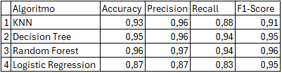
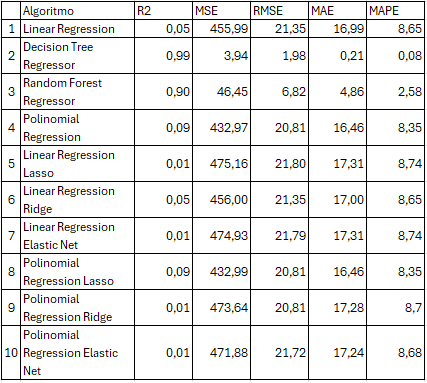
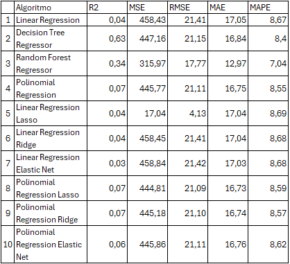
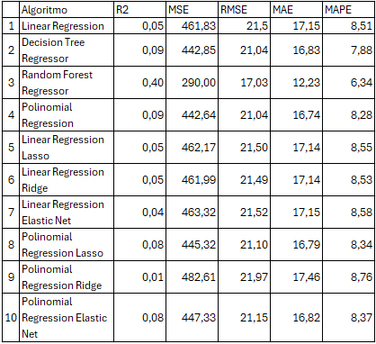
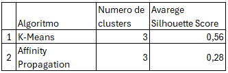

# Ensaio de Machine Learning
## Descrição
A empresa Data Money acredita que a expertise no treinamento e ajuste fino dos algoritmos, feito pelos Cientistas de Dados da empresa, é a principal motivo dos ótimos resultados que as consultorias vem entregando aos seus clientes.

## Objetivo
O objetivo desse projeto será realizar ensaios com algoritmos de Classificação, Regressão e Clusterização, para estudar a mudança do comportamento da performance, a medida que os valores dos principais parâmetros de controle de overfitting e underfitting mudam.

# Planejamento da solução
## Produto final
O produto final será 7 tabelas mostrando a performance dos algoritmos, avaliados usando múltiplas métricas, para 3 conjuntos de dados diferentes: Treinamento, validação e teste.

## Algoritmos ensaiados
### Classificação:
Algoritmos: KNN, Decision Tree, Random Forest e Logistic Regression
Métricas de performance: Accuracy, Precision, Recall e F1-Score

### Regressão:
Algoritmos: Linear Regression, Decision Tree Regressor, Random Forest Regressor, Polinomial Regression, Linear Regression Lasso, Linear Regression Ridge, Linear Regression Elastic Net, Polinomial Regression Lasso, Polinomial Regression Ridge e Polinomial Regression Elastic Net
Métricas de performance: R2, MSE, RMSE, MAE e MAPE

### Agrupamento:
Algoritmos: K-Means e Affinity Propagation
Métricas de performance: Silhouette Score

## Ferramentas utilizadas
Python 3.8 e Scikit-learn

# Desenvolvimento
## Estratégia da solução
Para o objetivo de ensaiar os algoritmos de Machine Learning, eu vou escrever os códigos utilizando a linguagem Python, para treinar cada um dos algoritmos e vou variar seus principais parâmetros de ajuste de overfitting e observar a métrica final.
O conjunto de valores que fizerem os algoritmos alcançarem a melhor performance, serão aqueles escolhidos para o treinamento final do algoritmo.

## O passo a passo
Passo 1: Divisão dos dados em treino, teste e validação.

Passo 2: Treinamento dos algoritmos com os dados de treinamento, utilizando os parâmetros “default”.

Passo 3: Medir a performance dos algoritmos treinados com o parâmetro default, utilizando o conjunto de dados de treinamento.

Passo 4: Medir a performance dos algoritmos treinados com o parâmetro “default”, utilizando o conjunto de dados de validação.

Passo 5: Alternar os valores dos principais parâmetros que controlam o overfitting do algoritmo até encontrar o conjunto de parâmetros apresente a melhor performance dos algoritmos.

Passo 6: Unir os dados de treinamento e validação

Passo 7: Retreinar o algoritmo com a união dos dados de treinamento e validação, utilizando os melhores valores para os parâmetros de controle do algoritmo.

Passo 8: Medir a performance dos algoritmos treinados com os melhores parâmetro, utilizando o conjunto de dados de teste.

Passo 9: Avaliar os ensaios e anotar os 3 principais Insights que se destacaram.

# Os top 3 Insights
### Insight Top 1
No ensaio de Classificação, os algoritmos baseados em árvores demonstraram um desempenho superior em todas as métricas quando avaliados nos dados de teste.

## Insight Top 2
A performance dos algoritmos de classificação sobre os dados de validação ficou bem próxima da performance sobre os dados de teste.

## Insight Top 3
A baixa performance dos algoritmos de regressão e clusterização reforça a importância de pré-processar dados de forma mais robusta, como realizar engenharia de atributos e normalização antes do treinamento.

# Resultados
## Ensaio de classificação:
### Sobre os dados de treinamento

### Sobre os dados de validação

### Sobre os dados de teste

## Ensaio de regressão:
### Sobre os dados de treinamento

### Sobre os dados de validação

### Sobre os dados de teste

## Ensaio de clusterização:

# Conclusão
Este ensaio de Machine Learning foi uma experiência enriquecedora, permitindo aprofundar meu entendimento sobre o funcionamento de algoritmos de classificação, regressão e clusterização, bem como os desafios relacionados ao ajuste fino de parâmetros para evitar underfitting e overfitting.

Aprendi que algoritmos baseados em árvores, como decision trees e random forests, são sensíveis à profundidade da árvore e ao número de árvores na floresta, destacando a importância de ajustar esses parâmetros para alcançar um equilíbrio ideal. Nos algoritmos de regressão, ficou evidente que o grau do polinômio é crucial para controlar o trade-off entre underfitting e overfitting.

Além disso, esta prática reforçou minha habilidade em preparar dados, analisar métricas de performance e identificar os limites e potenciais de diferentes técnicas. Esse projeto não só aprofundou meu conhecimento técnico, mas também fortaleceu minha capacidade de tomar decisões orientadas por dados para otimizar modelos de machine learning.

# Próximos passos
Como próximos passos desse ensaio, pretendo ensaiar novos algoritmos de Machine Learning e usar diferentes conjuntos de dados para aumentar o conhecimento sobre os algoritmos e quais cenários são mais favoráveis para o aumento da performance dos mesmos.
